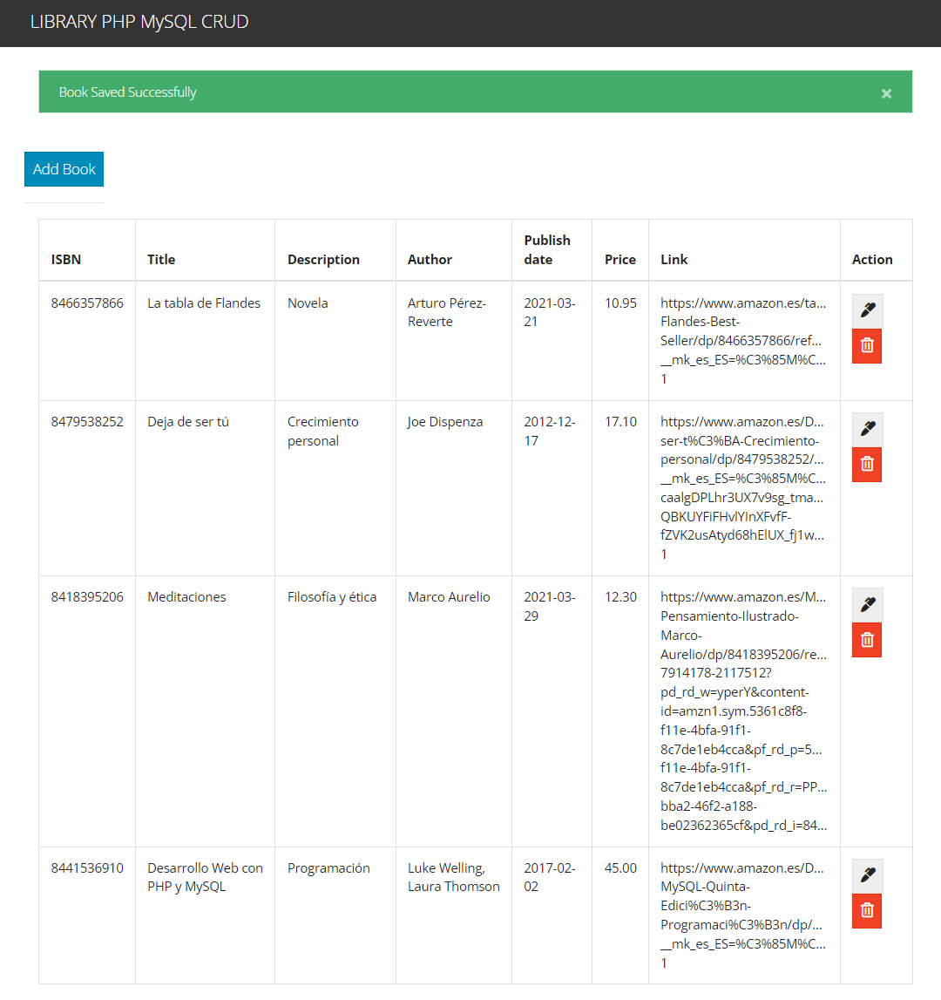

# Screenshot

# Entorno
- servidor web
- php 8
- servidor de bases de datos (mysql/mariadb)

# Instalación
- descargar el archivo zip de Github:
    https://github.com/vrandob/PHP-CRUD-MySQL-books-db

- descomprimir el archivo zip en la carpeta de documentos del servidor web:
    /var/www/html (en Linux)
    htdocs (en XAMPP)

- crear la base de datos con el script database/crud_books.sql

- crear un usuario y contraseña y darle permiso para acceder a la base de datos crud_libros
    admin/malaga2324

- modiifcar en el fichero db.php el usuario y contraseña creados

<?php
session_start();

$conn = mysqli_connect(
  'localhost',
  'admin',
  'malaga2324',
  'php_mysql_crud'
) or die(mysqli_erro($mysqli));

?>
- acceder en el navegador a la ruta
localhost/crud-books/
